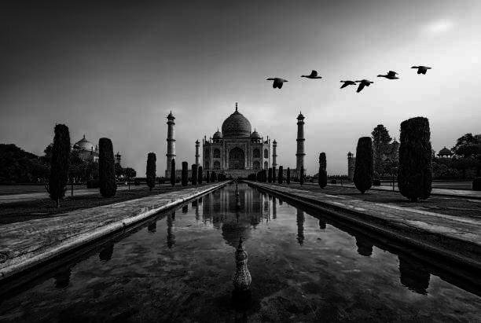
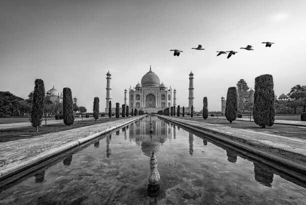
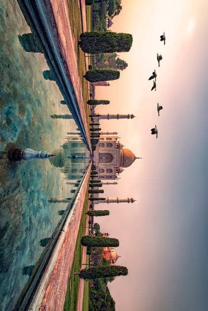
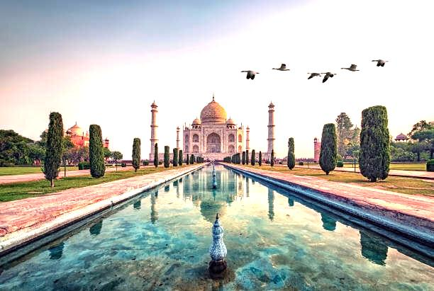

# Image-Editor
A simple Image-Editor written in JAVA.

# Structure:

- This image-editor has a command line interface. 
There is one class - ImageEditor , which contains a main function and 5 functions , namely
    - `mirror_image`
    - `gray_image`
    - `contrast_image`
    - `rotate_image`
    - `brightness_control`

# Command-Line-Interface : 

- `Giving instructions to user for entering the right commands which includes` : 
    - Enter mirror_image for mirroring image
    - Enter gray_image for making image to black and white mode
    - Enter contrast_image for increasing or decreasing the contrast of image
    - Enter rotate_image for rotating the image to the right side (90 degrees)
    - Enter  brightness_control for increasing or decreasing the brightness of the image.

- `Checking for valid commands and arguments` :

    - The structure of the command is \<command\> \<argument1\> \<argument2\>

    - In order to check for valid commands, an array of cmds has been created.

    - Since, the commands are being taken as an array of strings, the first part of the given arguments contains the command. This commmand is compared with each element of the array. If the command does not match with any of the elements of the cmds array, an error statement is printed, explaining the syntax of writing a command and a list of possible commands.

    -  The type of argument1 has to b compulsorily `.jpg` and argument2 is the name of the output file (which is `.jpg` file by default)

    - If there is any error in the program, it prints the exception in the terminal.

- `Taking the input file` :

    - Used the `System.java.io` module that creates a file-object and stores a given file in the file-object.

# Functions

    Original Image

- `mirror_image` :

    

    - It laterally inverts the image by fetching the rgb value of each pixel, and switches the ith pixel of each row with the (n-i)th pixel of that row.

    - Used `java.awt.image.BufferedImage` module to create an object of Buffered Image and process it and return the processed Buffered Image as the output.

- `gray_image` :

    

    - It uses the `gray-color-space` instead of the `3-byte-color-space`. This leads to the creation of a grayscaled image.

    - Used `java.awt.image.BufferedImage` module to create an object of Buffered Image and process it and return the processed Buffered Image as the output.

- `contrast_change` :

    

    - It traverses every pixel of the image, collects the rgb values for each pixel and sets all the three values r, g and b to the average of r,g and b values.

    - Used `java.awt.image.BufferedImage` module to create an object of Buffered Image and process it and return the processed Buffered Image as the output.

- `rotate_image`

    

    - It rotates the image `clockwise`. The function exchanges every row with the column i.e row becomes column and column becomes row.

    - Used `java.awt.image.BufferedImage` module to create an object of Buffered Image and process it and return the processed Buffered Image as the output.

- `brightness_control` :

    

    - This function takes an input as an integer, that gives the increase or decrease percentage of brightness and it increases the r, g, b values of every pixel of the image, by the percentage entered as input. This leads to an increase in the effective brightness. (In order to avoid error which might occur if r,g or b values surpass their threshold value : 255, there is a check done using the if block, ensuring that no value goes above 255, and gets caped at 255).In the given example input and output increased 50 percent of the real image.

    - Used `java.awt.image.BufferedImage` module to create an object of Buffered Image and process it and return the processed Buffered Image as the output.

### ~ By __*Abhinav Nagar*__